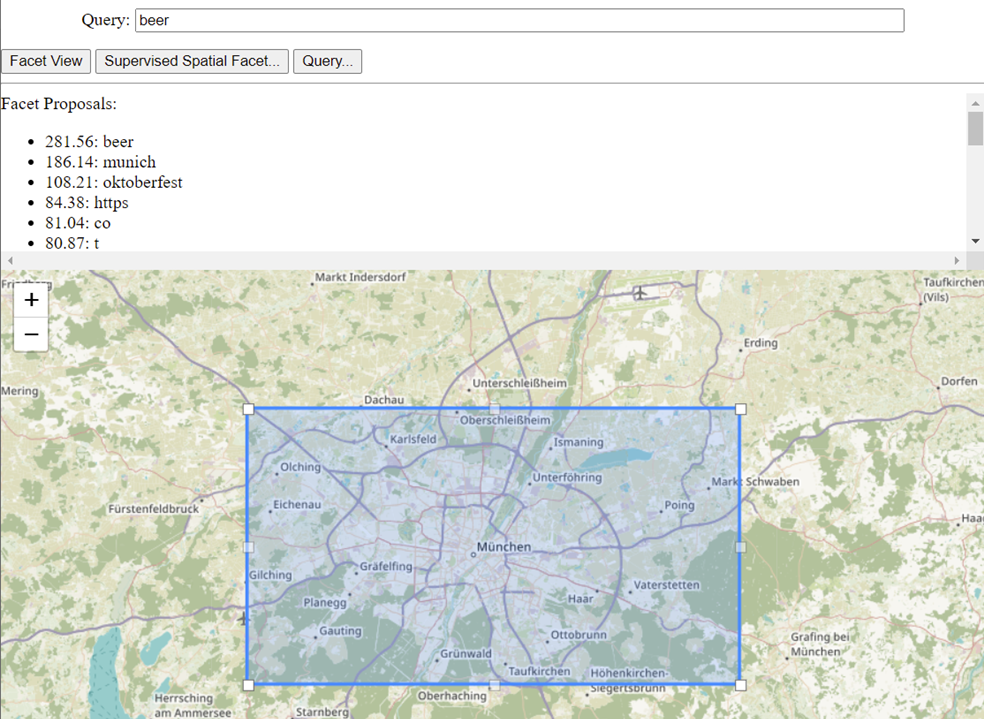

Spatial Facet Search
====================

Spatial facet search is a novel interactive search technique extending classical keyword search as known from information retrieval with four queries useful for mining corpus-specific toponyms from arbitrary queries in certain regions.

The demonstrative implementation in this repository is largely licensed under Apache 2.0 license and supports all queries in a sensible way. Note, however, that additional tricks and best practices should be applied when working on very large databases.

There is a paper describing this approach, which is under review. For now, we just give an overview of the contents of this git for early adopters.

We will work on making all of this more stable, more accessible, and are going to prepare a full tutorial on open data very soon.

For now, check out the core implementations that can be found in 
- [src/module.cpp](src/module.cpp) containing the SpatialFacetMiner class which is at the heart of this proposal.
- [Makefile](Makefile), [setup.py](setup.py), and [test.py](test.py) the minimal dev environment.
- [spacefillingfacet.py](spacefillingfacet.py) implements the spatial response map outputting to spacefillingfacet.csv in a format that is easy to read from GIS applications like QGIS
- [SimpleExperiments.ipynb](SimpleExperiments.ipynb) reproducing the synthetic data examples from the paper and, thereby, being the best place to explore for new users
- [webapp](webapp) contains a simple Web application (run ``python server.py``) which can be used to interactively search and explore spatial facets in databases
- [contrib](contrib) contains (initial) examples of how databases can be built from various data sources (Twitter, OpenStreetMap, Synthetic Examples). 

# Quick Start

## Prepare your system
If you want to use this, we expect that you are running some flavour of Linux (Docker files are created later). What you need is a working python3 development environment (Python3, C++ compiler, pip). 
## Compile the package
Then, ``python setup.py develop`` should build the native module. Therefore, the ``xapian`` search engine library should be installed with development files -- either built from source or ``apt-get install libxapian-dev`` on Debian flavours. 

You should find a shared object file representing the compiled model. Now it is time to spin up python3 and just run ``import spatialfacet``. If this works, you are ready to run all the scripts (after editing)

## Build a first database

You can now run [contrib/simple.py](contrib/simple.py) to create a very first database. This creates a directory simple (usually contrib/simple if you run it there).

## Jupyter friends
If you are a friend of Jupyter notebooks, you can as well spin up jupyter in this git, for example, ``jupyter notebook``, open the SimpleExamples.ipynb and explore the system

## Running the Web App
Running the web app is simple. All queries are in [webapp/engine.py](webapp/engine.py) and there, you will have to customize the ``cfg`` class to point to this database. Your database should be generated similar to the Twitter database concerning spatial values in slot 2 as a JSON object. Note that this is going to change soon...

Note that the web app misses error handling. Hence, if you wait too long for a query, hit F12 on your browser and look into the console if you had some other problems.

# Disclaimer
Beware that this is a demo in alpha-quality. You should never run something on the public Internet. The system lacks authentication, query time limits, and code review in terms of possible security flaws. 

